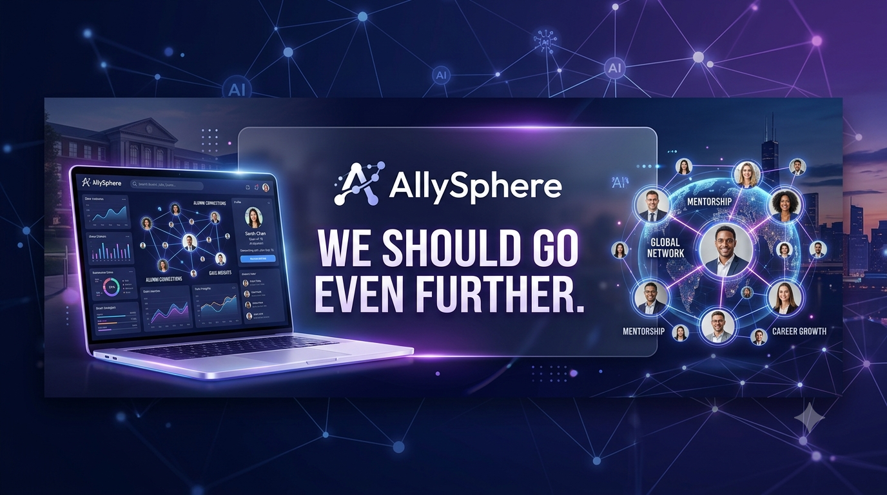
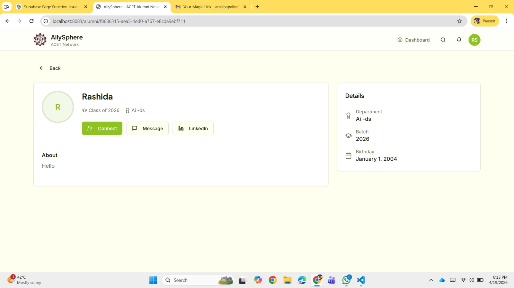
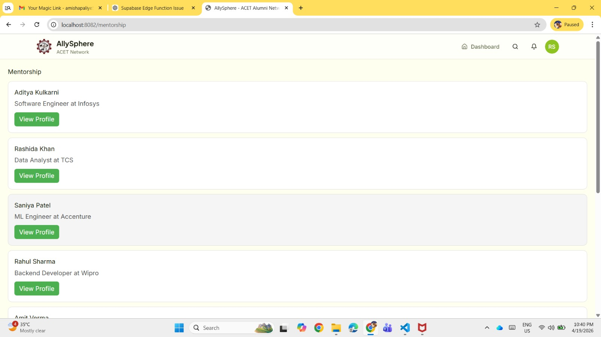
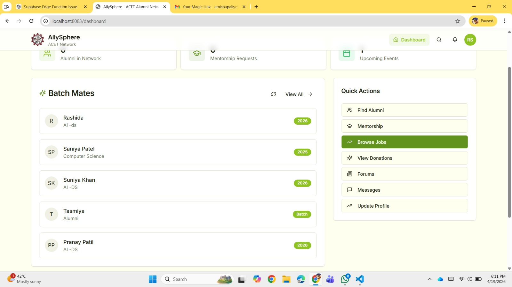
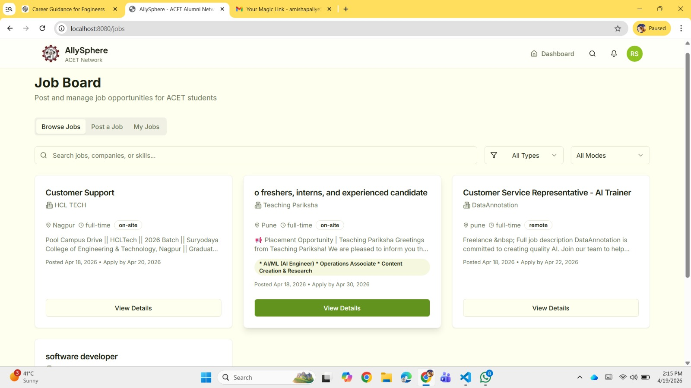
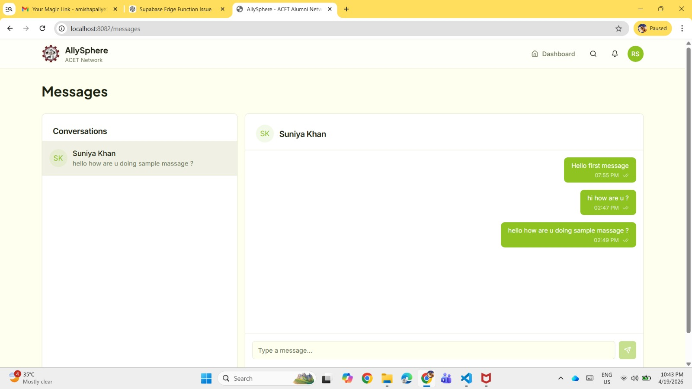
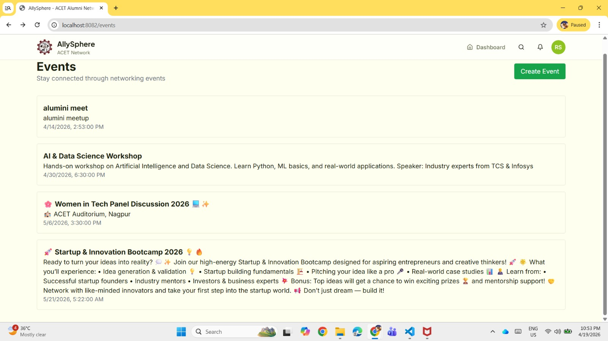
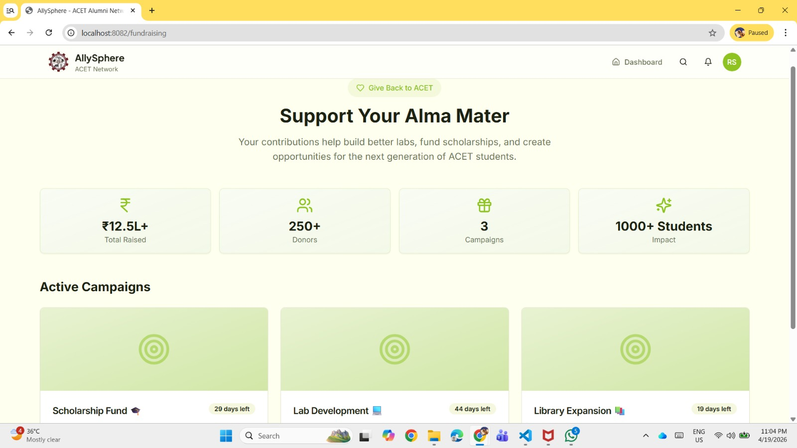
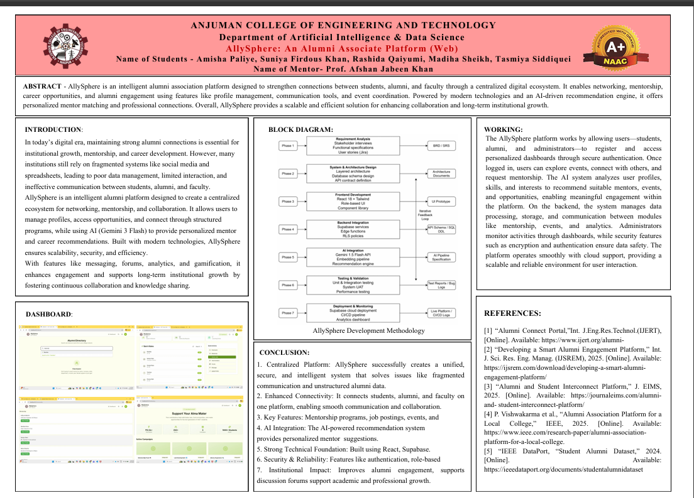

<p align="center">
  
</p>

<h1 align="center">🌐 AllySphere</h1>

<p align="center">
<b>AI-Powered Alumni Networking & Career Platform</b>
</p>

<p align="center">
Connecting Students, Alumni, Faculty and Recruiters through Mentorship, Networking, Career Opportunities and Community Engagement.
</p>

<p align="center">


</p>

<p align="center">

<a href="https://ally-sphere-chi.vercel.app">

</a>

</p>

---

# 📑 Table of Contents

- Overview
- Key Features
- Live Demo
- Screenshots
- System Architecture
- Tech Stack
- Project Structure
- About the Project
- Author

---

# 📖 Overview

AllySphere is an AI-powered alumni networking platform developed to strengthen connections between students, alumni, faculty members, and recruiters.

The platform enables mentorship, career guidance, professional networking, job opportunities, community discussions, event participation, and alumni engagement through a modern, secure, and responsive web application.

Designed with scalability and user experience in mind, AllySphere helps educational institutions build stronger alumni communities while providing students with meaningful career connections.

---

# ✨ Key Features

| Feature | Description |
|----------|-------------|
| 👨‍🎓 Alumni Directory | Search and connect with alumni across different batches |
| 🤝 Mentorship | Request mentorship and career guidance |
| 💼 Job Portal | Explore internships and job opportunities |
| 💬 Community Forum | Interact with the alumni community |
| 📅 Events | Participate in alumni and college events |
| 💳 Donations | Support institutional initiatives |
| 📩 Messaging | Connect with alumni through direct messaging |
| 👤 User Profiles | Professional student and alumni profiles |
| 📊 Dashboard | Personalized user dashboard |
| 🔐 Secure Authentication | Role-based authentication using Supabase |

---

# 🌐 Live Demo

### 🔗 https://ally-sphere-chi.vercel.app

Experience the live application and explore the platform.

---

# 📸 Project Screenshots

## 🏠 Dashboard

<p align="center">

</p>

---

## 👥 Alumni Directory

<p align="center">

</p>

---

## 👤 User Profiles

<p align="center">

</p>

---

## 🤝 Mentorship

<p align="center">

</p>

---

## 💼 Job Portal

<p align="center">

</p>

---

## 💬 Community Forum

<p align="center">

</p>

---

## 📩 Messaging

<p align="center">

</p>

---

## 📅 Events

<p align="center">

</p>

---

## 💳 Donations

<p align="center">

</p>

---

## 💳 Payment

<p align="center">

</p>

---

# 🏗️ System Architecture

The following diagram illustrates the overall architecture of the AllySphere platform, showcasing the interaction between the frontend, backend services, authentication, and database.

<p align="center">
  
</p>

---

# 🛠️ Tech Stack

| Category | Technologies |
|-----------|--------------|
| Frontend | React, TypeScript |
| Styling | Tailwind CSS, shadcn/ui |
| Backend | Supabase |
| Database | PostgreSQL |
| Authentication | Supabase Auth |
| Build Tool | Vite |
| Deployment | Vercel |

---

# 📂 Project Structure

```text
AllySphere
│
├── assets
│   └── bannerallysphere.png
│
├── docs
│   └── dashboard.pdf
│
├── screenshots
│   ├── dashboard.jpeg
│   ├── alumini.jpeg
│   ├── profiles.jpeg
│   ├── mentorship forum.jpeg
│   ├── community forum.jpeg
│   ├── job.jpeg
│   ├── message.jpeg
│   ├── events.jpeg
│   ├── donations.jpeg
│   └── payment page.jpeg
│
├── public
├── src
├── supabase
├── package.json
└── README.md
```

---

# 💡 About the Project

AllySphere was developed to bridge the gap between students and alumni by providing a centralized platform for networking, mentorship, professional growth, and community engagement.

The application demonstrates the use of modern full-stack technologies to build scalable educational platforms with responsive design, secure authentication, and real-time data management.

---

# 👩‍💻 Author

## Rashida Qaiyumi

**Artificial Intelligence & Data Science Graduate**

**Areas of Interest**

- 🤖 Artificial Intelligence
- 📊 Data Analytics
- 🌐 Full Stack Development
- 🚀 AI Automation
- 💡 Building Real-World AI Solutions

**GitHub**

https://github.com/rashidaqaiyumi

**Live Project**

https://vercel.com/rashida969qaiyumi-gmailcoms-projects/ally-sphere

---

<p align="center">

⭐ If you found this project useful, consider giving it a star.

</p>

<p align="center">

Made with ❤️ using React • TypeScript • Tailwind CSS • Supabase • Vite

</p>
